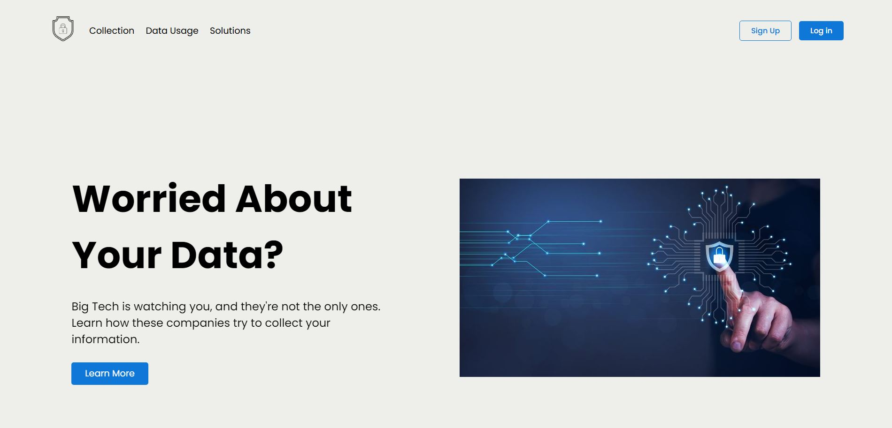

# DIGT-1172-Digital-Artifact

## Project: Informative Website about Online Privacy

### Overview:

Digital Artifact Website about Online Privacy created by Andrew Cao.

This website was created primarily with HTML and CSS, with a little bit of Javascript as learning for interactivity and DOM elements.

Sources used for the information are found in its own respective webpage at the very bottom.

##### Tools:

- Visual Studio Code
- HTML
- CSS
- Javascript
- Git
